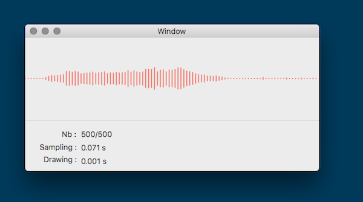
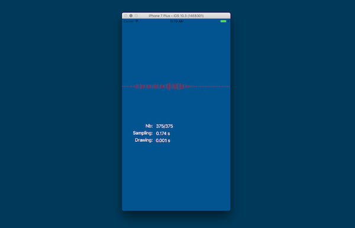

[](https://swift.org)  [](https://developer.apple.com/platforms/) [](https://github.com/Carthage/Carthage)


# SoundWaveForm

Allows to extract sound samples from Video or Sounds files very efficiently (it relies on the Accelerate framework). SoundWaveForm expose an optimized cross platform drawing that renders the waveform into an Image.

## It supports 

- macOS 10.11 & + 
- iOS 8 & + 
- swift 4.x (if you need to support swift 3 use the [v2.0.1] (https://github.com/benoit-pereira-da-silva/SoundWaveForm/releases/tag/v2.0.1))

# Screen Shots





# Usage sample 

The framework is composed of a SamplesExtractor and a WaveFormDrawer.

```swift 
// Extract the downsampled samples
let samples = try SamplesExtractor.samples(audioTrack: track, timeRange:nil ,desiredNumberOfSamples: 500)

// Draw the sample into an image.
let configuration = WaveformConfiguration(size: waveFormView.bounds.size,									 backgroundColor:WaveColor.lightGray,
                                          color: WaveColor.red,
                                          style: .striped,
                                       position: .middle,
                                          scale: 1)
// Let's display the waveform in a view                     
self.waveFormView.image = WaveFormDrawer.image(from: samples, with: configuration)
```

## How to extract sample from a specified timeRange?

You can define AVAssetReader.timeRange.

```swift

let asset = AVURLAsset(url: url)
let audioTracks:[AVAssetTrack] = asset.tracks(withMediaType: AVMediaTypeAudio)
if let track:AVAssetTrack = audioTracks.first{
	do{
		// Define the timeRange from second 1 to second 10
		let startTime = CMTime(seconds: 1, preferredTimescale: 1000)
		let endTime = CMTime(seconds: 10, preferredTimescale: 1000)
	   let timeRange = CMTimeRangeMake(startTime, endTime)

		// Proceed to extraction (refer to previous code)
		let samples = try SamplesExtractor.samples(audioTrack: track, timeRange:timeRange,desiredNumberOfSamples: 500)
    }catch{
    	...
    }	
}
```

## Installation via Carthage

Add to your Cartfile : ` github "benoit-pereira-da-silva/SoundWaveForm"` 


## Inspiration

This project has been largely inspired by [FDWaveformView](https://github.com/fulldecent/FDWaveformView) and [DSWaveformImage](https://github.com/dmrschmidt/DSWaveformImage). Thanks to William aka [@fulldecent](https://github.com/fulldecent/) and Daniel [@dmrschmidt](https://github.com/dmrschmidt/).
	
